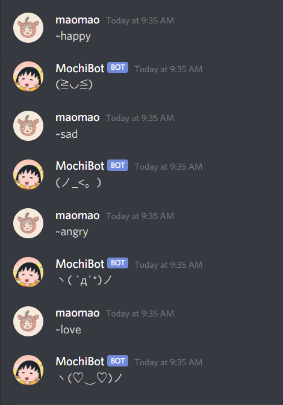

# MochiBot

MochiBot is a discord bot to help you send cute kaomojis (emoticons derived from special characters) in your Discord channel.
Currently, 4 emotions are supported: happy, sad, angry, and love!



## Invite MochiBot to Your Server

[Invite MochiBot here](https://discord.com/api/oauth2/authorize?client_id=718227625688170497&permissions=129024&scope=bot)

## Commands

Happy

```happy
~happy
```

Sad

```sad
~sad
```

Angry

```angry
~angry
```

Love

```love
~love
```
